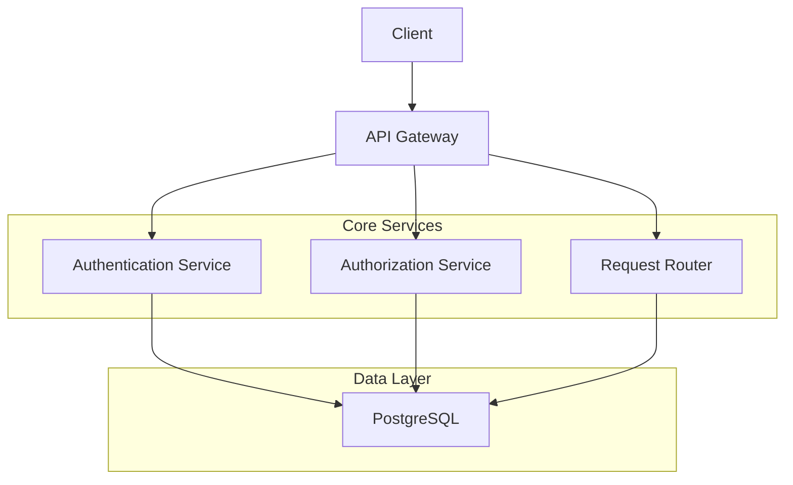
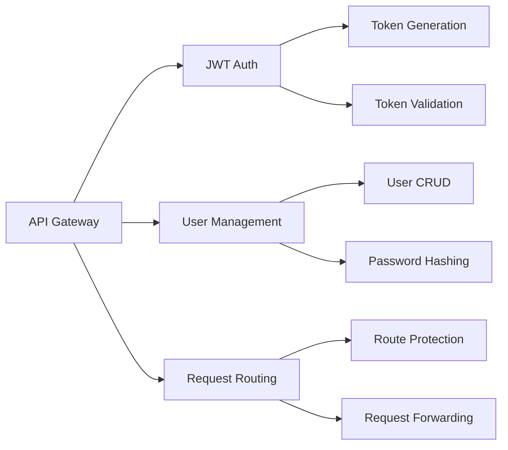
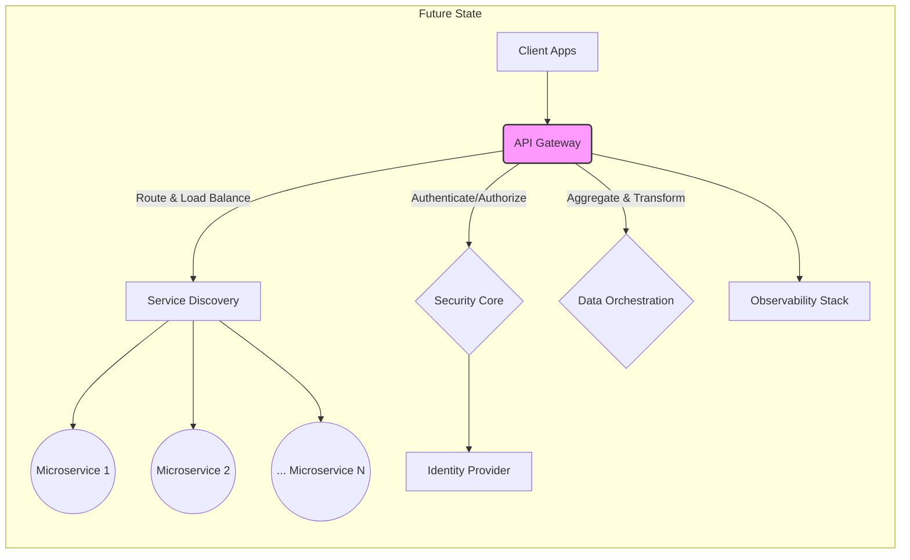
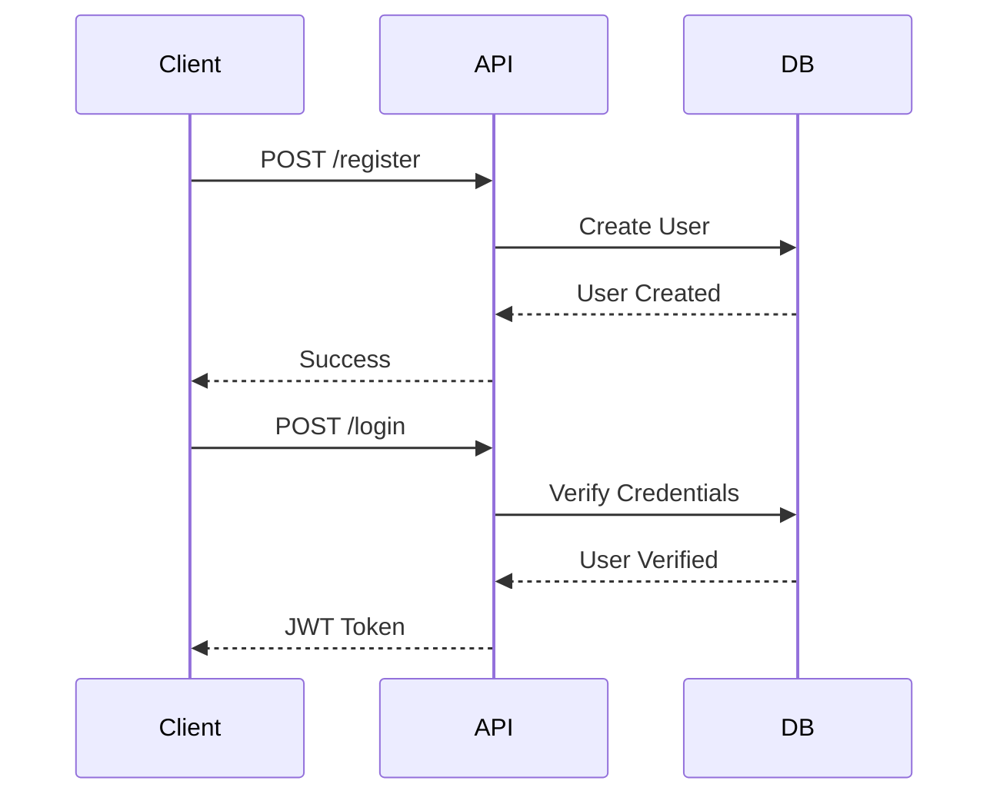
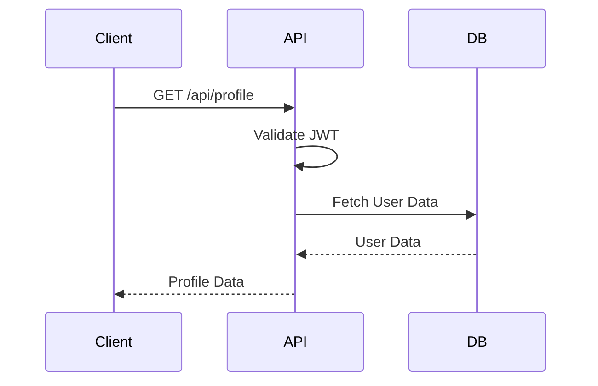

```mermaid
%%{init: {'theme': 'base', 'themeVariables': { 'primaryColor': '#f0f5ff', 'primaryBorderColor': '#1677ff', 'secondaryColor': '#f6ffed', 'tertiaryColor': '#fff7e6', 'noteBkgColor': '#fff0f6' }}}%%
flowchart LR
    classDef foundation fill:#f0f5ff,stroke:#1677ff,stroke-width:2px,color:#1677ff
    classDef extensions fill:#f6ffed,stroke:#52c41a,stroke-width:2px,color:#52c41a
    classDef observability fill:#fff7e6,stroke:#fa8c16,stroke-width:2px,color:#fa8c16
    classDef scale fill:#fff0f6,stroke:#eb2f96,stroke-width:2px,color:#eb2f96
    
    subgraph stage1[Foundation]
        F1(Fix DB Connections):::foundation
        F2(Standardize Auth Flow):::foundation
        F3(Resolve JWT Issues):::foundation
        F4(HTTPS & Security Headers):::foundation
    end
    
    subgraph stage2[Extensions]
        E1(API Versioning):::extensions
        E2(Rate Limiting):::extensions
        E3(Request Validation):::extensions
        E4(API Documentation):::extensions
    end
    
    subgraph stage3[Observability]
        O1(Log Aggregation):::observability
        O2(Request Tracing):::observability
        O3(Performance Metrics):::observability
        O4(Alerting System):::observability
    end
    
    subgraph stage4[Scale]
        S1(Caching Strategy):::scale
        S2(Load Balancing):::scale
        S3(Circuit Breaking):::scale
        S4(Service Mesh Integration):::scale
    end
    
    stage1 --> stage2
    stage2 --> stage3
    stage3 --> stage4
```

# 🚀 API Gateway

A modern API Gateway implementation in Go, providing authentication, authorization, and request routing capabilities.

<div align="center">

[](https://golang.org)
[](LICENSE)
[](https://www.postgresql.org)
[](https://jwt.io)

</div>

## 📋 Table of Contents
- [Architecture](#-architecture)
- [Features](#-features)
- [Current Status](#-current-status)
- [Project Roadmap](#-project-roadmap)
- [Architectural Vision](#-architectural-vision--evolution)
- [Getting Started](#-getting-started)
- [API Documentation](#-api-documentation)
- [Development](#-development)

## 🏗 Architecture



### Component Overview



## ✨ Features

- 🔐 JWT-based authentication
- 👥 User management with PostgreSQL
- 🛡 Protected routes with middleware
- 📊 Request logging and monitoring
- 🔄 Request routing and forwarding
- 🧪 Debug endpoints for testing

## 🚧 Current Status

### What's Working
- Basic user registration
- JWT token generation
- PostgreSQL integration
- Debug endpoints

### Known Issues
- Database connection stability
- JWT token validation discrepancies
- Password hashing consistency

## 🛣️ Project Roadmap

<div align="center">

<table style="border: none; background-color: transparent;">
  <tr>
    <td align="center" width="20%">
      <div style="background-color: #f0f5ff; padding: 20px; border-radius: 8px; border: 1px solid #d6e4ff;">
        <h3 style="margin: 0; color: #1677ff;">🔧 Foundation</h3>
        <p>Core stability & security</p>
      </div>
    </td>
    <td align="center" width="15%">
      <div style="padding: 10px;">
        ➡️
      </div>
    </td>
    <td align="center" width="20%">
      <div style="background-color: #f6ffed; padding: 20px; border-radius: 8px; border: 1px solid #b7eb8f;">
        <h3 style="margin: 0; color: #52c41a;">🧩 Extensions</h3>
        <p>API features & integrations</p>
      </div>
    </td>
    <td align="center" width="15%">
      <div style="padding: 10px;">
        ➡️
      </div>
    </td>
    <td align="center" width="20%">
      <div style="background-color: #fff7e6; padding: 20px; border-radius: 8px; border: 1px solid #ffd591;">
        <h3 style="margin: 0; color: #fa8c16;">🔍 Observability</h3>
        <p>Monitoring & insights</p>
      </div>
    </td>
    <td align="center" width="15%">
      <div style="padding: 10px;">
        ➡️
      </div>
    </td>
    <td align="center" width="20%">
      <div style="background-color: #fff0f6; padding: 20px; border-radius: 8px; border: 1px solid #ffadd2;">
        <h3 style="margin: 0; color: #eb2f96;">🚀 Scale</h3>
        <p>Performance & resilience</p>
      </div>
    </td>
  </tr>
</table>

</div>



<div align="center" style="margin-top: 30px; margin-bottom: 30px;">
<h3>📋 Implementation Progress</h3>
</div>

<div align="center">
<table style="border: none; width: 80%;">
  <tr>
    <td width="25%" style="background-color: #f0f5ff; padding: 10px; border-radius: 4px;">
      <b>Foundation</b><br />
      <div style="width: 100%; background-color: #e6f7ff; height: 10px; border-radius: 5px;">
        <div style="width: 30%; background-color: #1677ff; height: 10px; border-radius: 5px;"></div>
      </div>
      <div style="text-align: right; font-size: 12px; color: #1677ff;">30%</div>
    </td>
    <td width="25%" style="background-color: #f6ffed; padding: 10px; border-radius: 4px;">
      <b>Extensions</b><br />
      <div style="width: 100%; background-color: #e6f7ff; height: 10px; border-radius: 5px;">
        <div style="width: 10%; background-color: #52c41a; height: 10px; border-radius: 5px;"></div>
      </div>
      <div style="text-align: right; font-size: 12px; color: #52c41a;">10%</div>
    </td>
    <td width="25%" style="background-color: #fff7e6; padding: 10px; border-radius: 4px;">
      <b>Observability</b><br />
      <div style="width: 100%; background-color: #e6f7ff; height: 10px; border-radius: 5px;">
        <div style="width: 5%; background-color: #fa8c16; height: 10px; border-radius: 5px;"></div>
      </div>
      <div style="text-align: right; font-size: 12px; color: #fa8c16;">5%</div>
    </td>
    <td width="25%" style="background-color: #fff0f6; padding: 10px; border-radius: 4px;">
      <b>Scale</b><br />
      <div style="width: 100%; background-color: #e6f7ff; height: 10px; border-radius: 5px;">
        <div style="width: 0%; background-color: #eb2f96; height: 10px; border-radius: 5px;"></div>
      </div>
      <div style="text-align: right; font-size: 12px; color: #eb2f96;">0%</div>
    </td>
  </tr>
</table>
</div>

<div align="center" style="margin-top: 30px;">
<h3>🎯 Current Focus: Foundation</h3>
<p style="max-width: 600px; margin: 0 auto;">Working on stabilizing core functionality, fixing database connection issues, and ensuring JWT authentication works reliably before moving to the next stage.</p>
</div>

## 🌱 Architectural Vision & Evolution

This API Gateway is envisioned as the **central nervous system** for a modern microservices architecture. It's designed to be robust, scalable, and developer-friendly, empowering seamless communication and secure access across your digital ecosystem.



### Key Pillars of Evolution:

1.  **Rock-Solid Security Core**: Enhancing the current JWT foundation with features like fine-grained permissions (RBAC/ABAC), API key management, OAuth 2.0/OIDC integration, and robust protection against common web vulnerabilities (OWASP Top 10).

2.  **Intelligent Routing & Resilience**: Moving beyond basic routing to implement dynamic service discovery, sophisticated load balancing strategies, circuit breaking patterns, and automated request retries to ensure high availability and fault tolerance.

3.  **Seamless Developer Experience**: Providing comprehensive, auto-generated API documentation (Swagger/OpenAPI), a dedicated developer portal, request/response transformation capabilities, and powerful debugging tools.

4.  **Actionable Observability**: Integrating deep logging, distributed tracing, and real-time metrics collection, feeding into dashboards and alerting systems to provide clear insights into performance, usage patterns, and system health.

5.  **Performance & Scalability**: Optimizing for low latency and high throughput via techniques like response caching, connection pooling, and horizontal scalability to handle growing traffic demands effortlessly.

This evolution aims to create not just a gateway, but a **strategic control plane** that simplifies complexity, enforces security policies, and provides invaluable insights, ultimately accelerating development and enhancing the reliability of your backend services.

## 🚀 Getting Started

### Prerequisites
- Go 1.21 or later
- PostgreSQL 14 or later
- Make (optional)

### Installation

1. Clone the repository:
```bash
git clone https://github.com/yourusername/apigateway.git
cd apigateway
```

2. Install dependencies:
```bash
go mod download
```

3. Set up environment:
```bash
cp .env.example .env
# Edit .env with your configuration
```

4. Start the server:
```bash
go run main.go
```

## 📚 API Documentation

### Authentication Endpoints



### Protected Endpoints



## 🛠 Development

### Project Structure
```
.
├── auth/           # Authentication logic
├── db/            # Database operations
├── models/        # Data models
├── main.go        # Entry point
└── README.md      # Documentation
```

### Running Tests
```bash
go test ./...
```

### Code Style
- Follow Go standard formatting
- Use meaningful variable names
- Add comments for complex logic
- Write tests for new features

## 🤝 Contributing

1. Fork the repository
2. Create your feature branch
3. Commit your changes
4. Push to the branch
5. Create a Pull Request

## 📝 License

This project is licensed under the MIT License - see the [LICENSE](LICENSE) file for details.

---

<div align="center">
Made with ❤️ by Yashu
</div>
