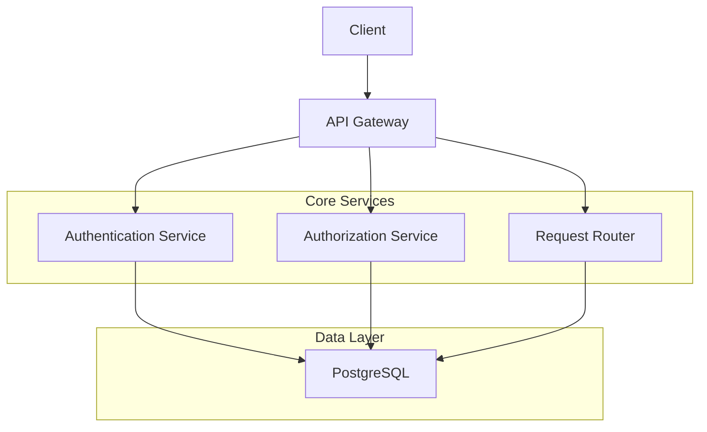
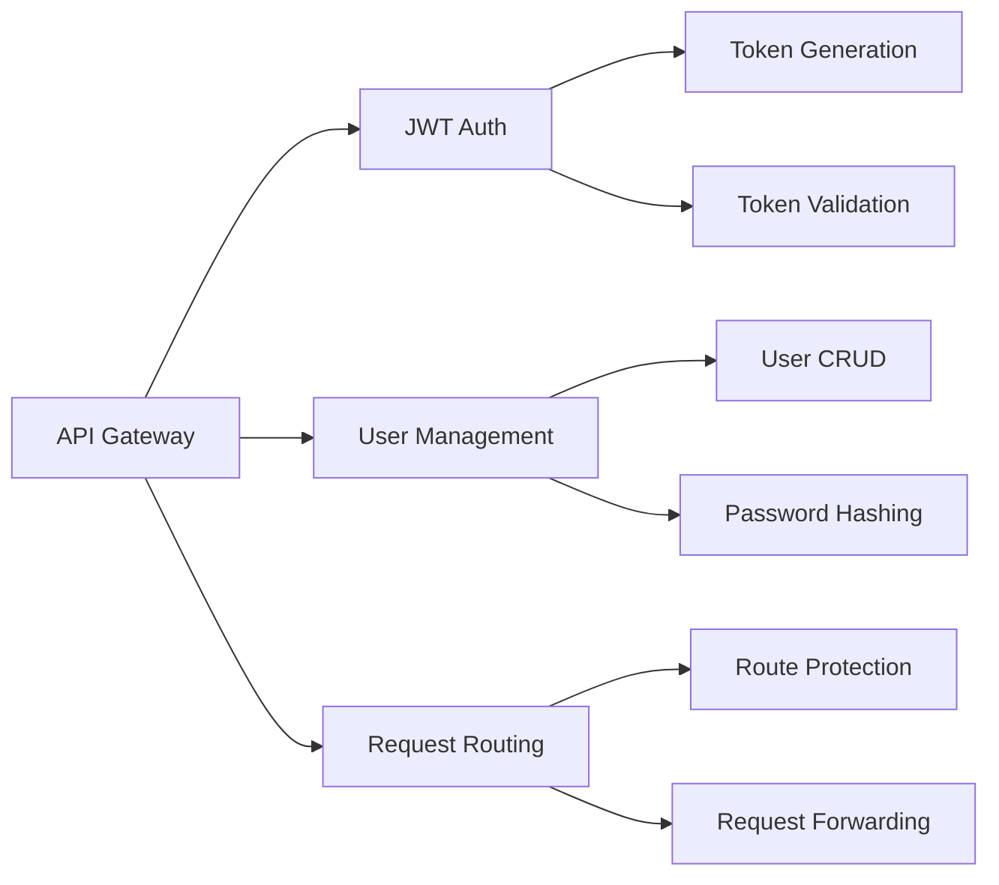
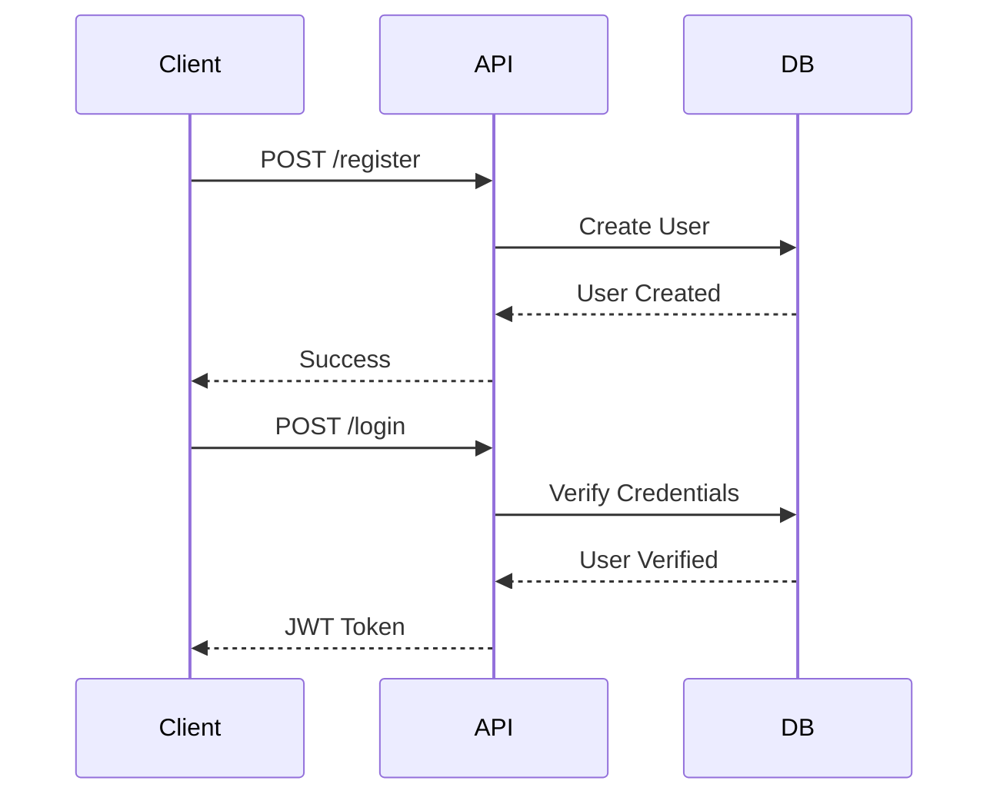
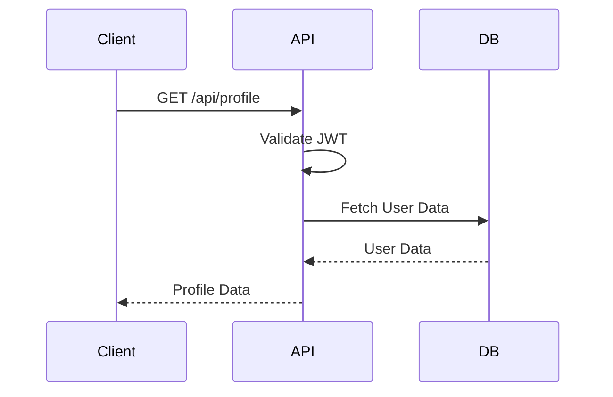

# 🚀 API Gateway

A modern API Gateway implementation in Go, providing authentication, authorization, and request routing capabilities.

<div align="center">

[](https://golang.org)
[](LICENSE)
[](https://www.postgresql.org)
[](https://jwt.io)

</div>

## 📋 Table of Contents
- [Architecture](#-architecture)
- [Features](#-features)
- [Current Status](#-current-status)
- [Roadmap](#-roadmap)
- [Getting Started](#-getting-started)
- [API Documentation](#-api-documentation)
- [Development](#-development)

## 🏗 Architecture



### Component Overview



## ✨ Features

- 🔐 JWT-based authentication
- 👥 User management with PostgreSQL
- 🛡 Protected routes with middleware
- 📊 Request logging and monitoring
- 🔄 Request routing and forwarding
- 🧪 Debug endpoints for testing

## 🚧 Current Status

### What's Working
- Basic user registration
- JWT token generation
- PostgreSQL integration
- Debug endpoints

### Known Issues
- Database connection issues with certain credentials
- JWT token validation errors
- Password hashing inconsistencies

## 🗺 Roadmap

### Week 1: Core Stability
- [ ] Fix database connection issues
- [ ] Resolve JWT token validation
- [ ] Standardize password hashing
- [ ] Add comprehensive error handling

### Week 2: Enhanced Security
- [ ] Implement rate limiting
- [ ] Add request validation
- [ ] Set up secure headers
- [ ] Add API key authentication

### Week 3: Monitoring & Logging
- [ ] Add request logging
- [ ] Implement metrics collection
- [ ] Set up health checks
- [ ] Add performance monitoring

### Week 4: Advanced Features
- [ ] Add request caching
- [ ] Implement circuit breakers
- [ ] Add request transformation
- [ ] Set up API documentation

## 🚀 Getting Started

### Prerequisites
- Go 1.21 or later
- PostgreSQL 14 or later
- Make (optional)

### Installation

1. Clone the repository:
```bash
git clone https://github.com/yourusername/apigateway.git
cd apigateway
```

2. Install dependencies:
```bash
go mod download
```

3. Set up environment:
```bash
cp .env.example .env
# Edit .env with your configuration
```

4. Start the server:
```bash
go run main.go
```

## 📚 API Documentation

### Authentication Endpoints



### Protected Endpoints



## 🛠 Development

### Project Structure
```
.
├── auth/           # Authentication logic
├── db/            # Database operations
├── models/        # Data models
├── main.go        # Entry point
└── README.md      # Documentation
```

### Running Tests
```bash
go test ./...
```

### Code Style
- Follow Go standard formatting
- Use meaningful variable names
- Add comments for complex logic
- Write tests for new features

## 🤝 Contributing

1. Fork the repository
2. Create your feature branch
3. Commit your changes
4. Push to the branch
5. Create a Pull Request

## 📝 License

This project is licensed under the MIT License - see the [LICENSE](LICENSE) file for details.

---

<div align="center">
Made with ❤️ by [Your Name]
</div> 